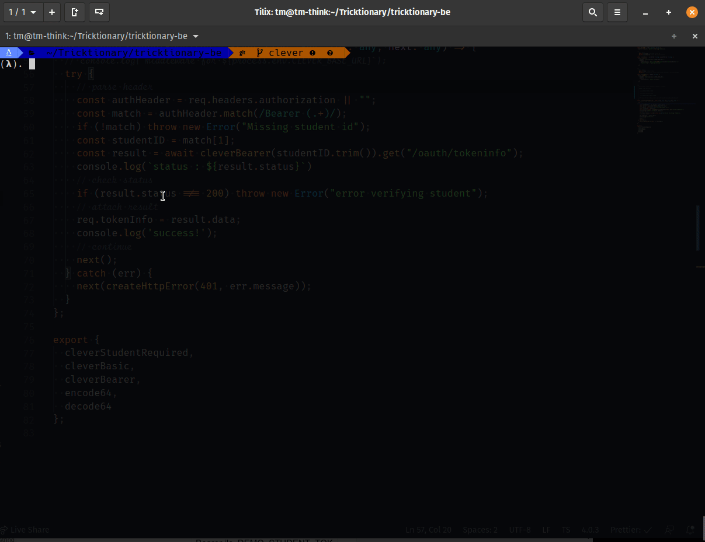

**Clever**

|Method | URL | Description |
|-------|-----|-------------|
| GET  | /api/clever | testing middleware |

#

### GET /api/clever
Request Header:
```
{
    Authorization: "Bearer TOKEN",
}
```
Returns:
```
{
    ok: true,
    message: "Clever student verified"
}
```
